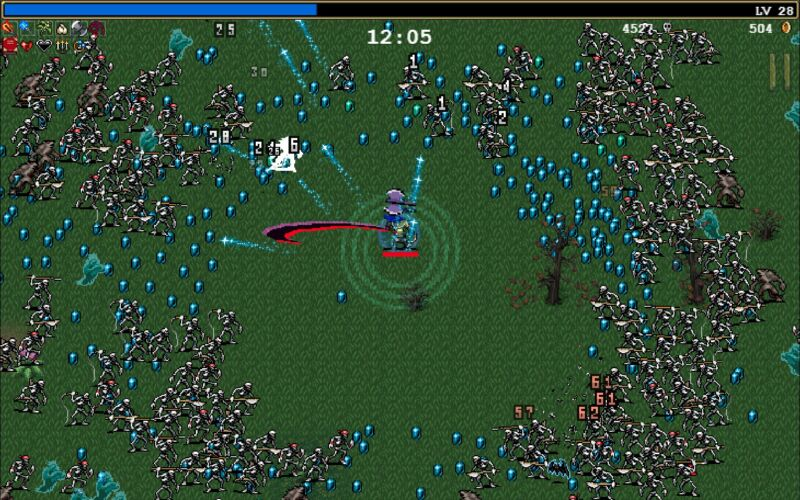
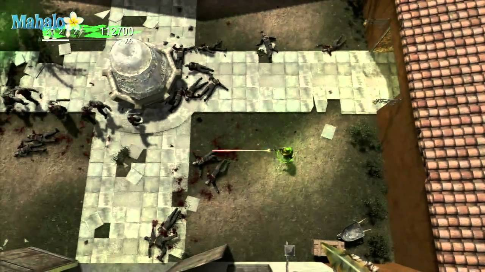

# Milestone 1

## VIE idea

### Summary
A fast pased top-down shooter where agents spawn outside the screen and attack the player in waves. 

### Key game features
* The game is in 3D, but the gameplay dimension is 2D.
* Top down camera where the player is in the center.
* The player can be moved with the keyboard, and aim a weapon and shoot it with the mouse.
* Autonomous agents spawn outside the screen and attack the player in waves.
* Attacks to the player reduces the player's health, and when it reaches zero the game is over.
* Physics engine for realistic movement and collisions between player and enemies.

### Game loop
Start menu -> Player spawns in scene -> Enemies spawn and attack in waves -> Game over when player dies (gets a score) -> Start menu

### Benchmark titles
#### Vampire Survivors

#### CoD: Black Ops - Dead Ops Arcade

## Development environment
Language: C#

Framework: MonoGame [https://docs.monogame.net/index.html](https://docs.monogame.net/index.html) (3D rendering, input, audio, lighting)

Libraries: bepuhysics [https://www.bepuentertainment.com/](https://www.bepuentertainment.com/) (Physics)

