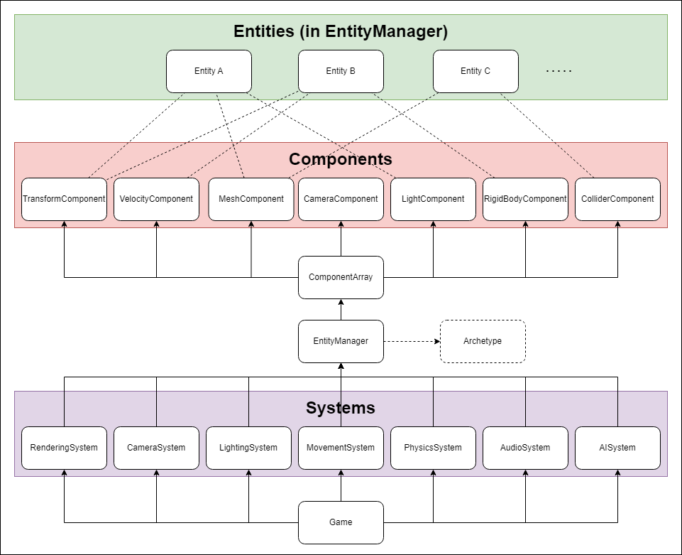
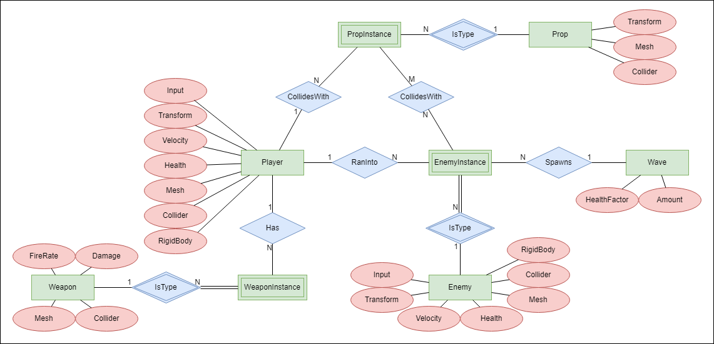

# Milestone 2

## Entity Component Systems

Entity-Component-System (ECS) design is a technique widely used in game development and game engines to achieve a data oriented result. The idea is to separate data from behaviour in order to gain better performance and increase flexibility. 

**Entities** are defined as distinct objects with unique identifier. This could for example be a player, an enemy or a weapon. An important note is that entities contain no actual data or behaviours (i.e., no component references).

**Components** are datatypes with unique behaviours that can be assigned to entities through mapping (not referencing). Example of components are transforms, meshes or rigidbodies. They are usually stored in a datastructure that is efficient to query from. The datastructure should also be responsible for mapping components to entities.

**Systems** are responsible for iterating through the component storage and updating components accordingly. You could for example have systems for rendering, physics, audio or handling input. As an application, a camera system would update every entity containing a camera component.

## Engine design

We have created an [API outline](https://github.com/Mehdows/D7049E-game-engine/blob/main/Milestones/Milestone-2/API-Outline-Engine.pdf) that shows classes with attributes and methods that will make up our game engine in C# (MonoGame). The API outline is also visualised in the ECS diagram below. We consider a game loop that updates every frame and holds references to all systems. In turn, each system holds a reference to the EntityManager which is responsible for creating and removing entities and storing them in a list, adding and removing components, and also keeping track of the mapping between entities and objects.

There are a number of different approaches to handle the mapping, and some are more efficient than others. A simple approach that's efficient for large data, but less efficient for querying components based on specific criteria, is to store each component type in a separate array where each element in the array corresponds to an entity. Another approach is to use archetype-based storage which is when entities are grouped into archetypes based on their component types. This is used in Unity for efficient querying in large-scale games. You could also for example use [sparse sets](https://www.geeksforgeeks.org/sparse-set/). The exact implementation will be decided at a later stage, but we will probably go for a simpler approach initially.

As shown in the diagram, the datastructure which we have chosen to just call ComponentArray for now, contains all components that are attached to entities. The dotted arrows between entities and components show examples of some entity instances that are mapped to some components. Note that some of the components and systems that we have defined may not be needed, and we may also need to add additional parts in the future.

Some pros and cons in regard to our engine design:

Pros:
* It's easy to add new components since the parts of the engine are so decoupled. This is especially important for game engines where you often want to add new components that are customized for the game you're developing.
* The components provide high reusability. You would for example probably like to use a transform and mesh component on most of your entities, which you can with this implementation.
* Good performance because of the component querying where you only modify relevant data without having to consider which entities it belongs to.

Cons:
* ECS is a pattern that's not as well established as for example OOP. This can make it hard to find relevant information about how you should actually implement the different parts. It can also make it harder to collaborate since it's not well known what the best practices are.
* If the developers are not careful, it's easy to accidentaly implement ECS in such a way so that it doesn't have any actual performance benefits. You have to really think about how you implement the component storage and system interactions with the components. A normal problem is cache misses if data is spread across multiple arrays.

## Game design

The game idea has been presented in Milestone 1, so here we just provide an ER diagram of how the different parts could be connected in regard to our engine definition. The diagram uses [Chen Notation](https://vertabelo.com/blog/chen-erd-notation/), where green rectangles show entities, red ovals show components, and blue diamonds show relations. We will have to add some new component types, such as character health and weapon specific components, which will be easy since we use the ECS design.

Entities contained in two rectangles are known as weak entites as they can't be uniquely identified by their attributes alone, and instead depend on an owner entity. In our case we have for example enemy instances where the defining owner is the enemy entity.

Note that the diagram may have to change as the development progresses.

