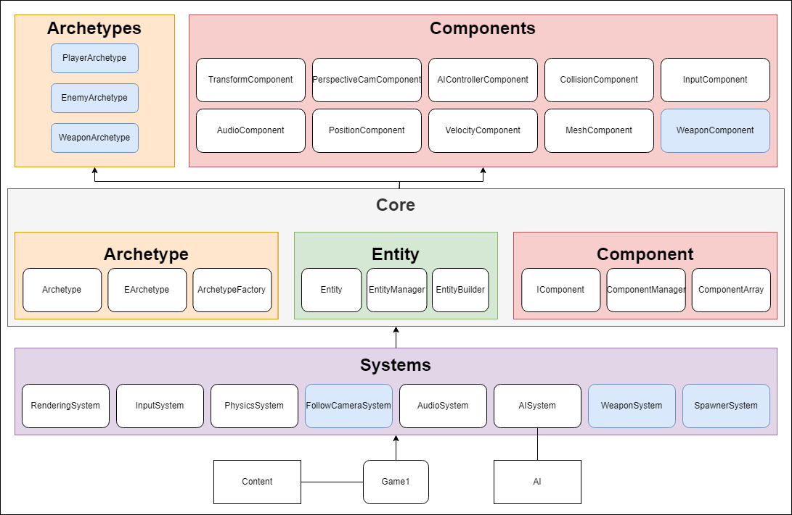
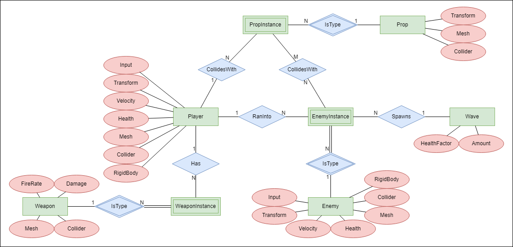
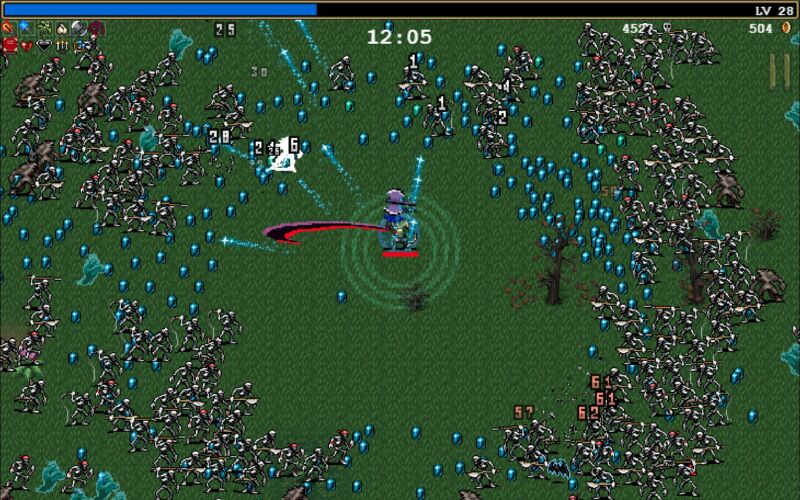
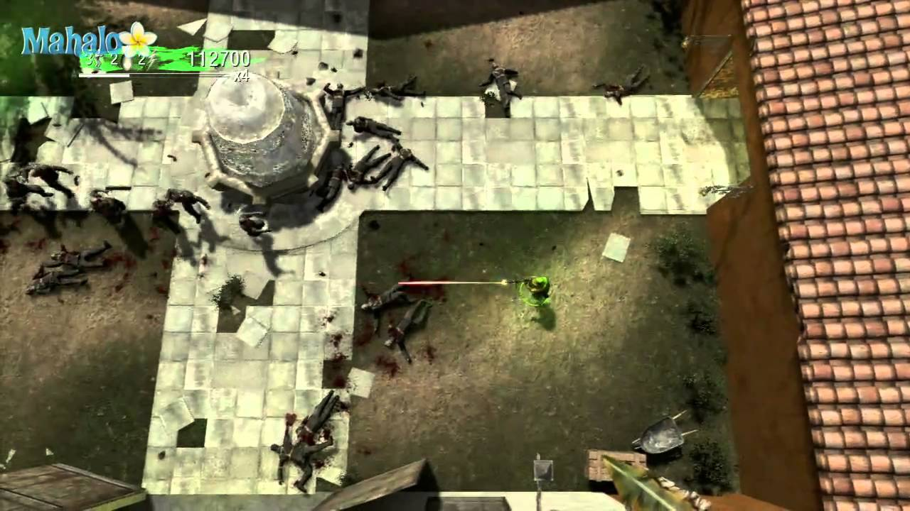

# D7049E, Virtual interactive environments, Lp4, V23
Virtual interactive environments or VIEs are computer-generated 
environments that simulate a physical environment, 
allowing users to interact with the virtual world in real-time.

In this course we were asked to create a game engine using a data oriented approach and implement a simple game using the engine. 
We decided to write ours in C# using the [MonoGame framework](https://www.monogame.net/) together 
with [BEPU Physics](https://www.bepuentertainment.com/).

## Game Engine
The engine was built using our own Enitity Component System implementation (See figures below). Entity Component System (ECS) 
design is a technique widely used in engine and game development to achieve a data-oriented approach. 
The main idea of an ECS is to separate data from behaviour in order to gain better performance and increased 
flexibility. Separation comes in the form of having three different parts with different purposes, 
which are entities, components and systems.

The engine features support for 3D physics, 3D models, AI Behaviour trees, cameras, and more!

## The Game
When designing the game lying on top of the game engine, we wanted to make
something that would be simple and easy to implement in the given time span,
but also something that allowed us to test and measure all parts of the engine.
Our idea was top create a top-down shooter where enemies spawn in waves
and attack the player in the center of the screen, similar to games like Vampire
Survivors and Call of Duty zombie mode (specifically, the level Dead Ops Arcade
from Call of Duty: Black Ops).  

*Inspiration:*  

*Our game:*  

## Final notes
Milestones are provided in the "Milestones" folder.
